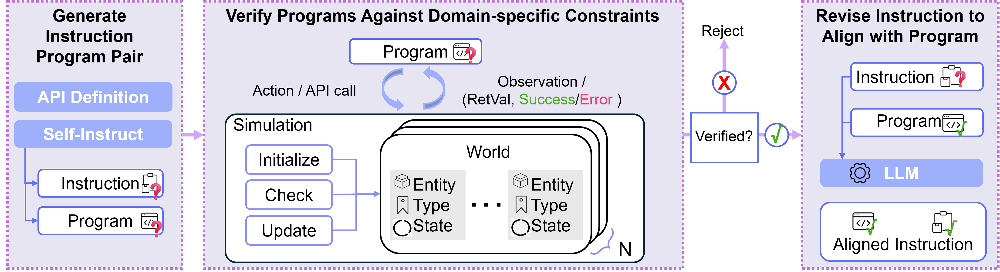

# Robo-Instruct: Simulator-Augmented Instruction Alignment for Finetuning CodeLLMs

**[[Project Page]](https://amrl.cs.utexas.edu/robo-instruct/) • [[Paper]](https://amrl.cs.utexas.edu/robo-instruct/assets/documents/Democratizing_LLM_arvix.pdf)**

Zichao Hu<sup>1</sup>, Junyi Jessy Li<sup>1</sup>, Arjun Guha<sup>2</sup>, Joydeep Biswas<sup>1</sup>  
<sup>1</sup>UT Austin  <sup>2</sup>Northeastern University

<p align="center">
  
</p>

---

## 🚀 Environment Setup

1. Clone this repository:
   ```bash
   git clone git@github.com:ut-amrl/robo-instruct.git
   cd robo-instruct
   ```

2. Create and activate the Conda environment:
    ```bash
    conda create --name robo-instruct python=3.10 -y
    conda activate robo-instruct
    ```

3. Install dependencies:
    ```bash
    pip install -e .
    ```

## 🧠 Generate Data Using Robo-Instruct
The data generation pipeline is located in robo_instruct/generate_data. It consists of three sequential steps:

Generate instruction-program pairs:
```bash
cd robo_instruct/generate_data
python generate_instructions.py --save_name {INSTRUCTION_PATH}
python generate_programs.py --input_name {INSTRUCTION_PATH} --save_name {INSTRUCTION_PROGRAM_PATH}
 ```

Filter invalid programs via RoboSim:
```bash
python generate_robosim.py --input_name {INSTRUCTION_PROGRAM_PATH} --save_name {FILTERED_DATA_PATH}
```

Align instructions with programs:
```bash
python generate_instalign.py --input_name {FILTERED_DATA_PATH} --save_name {ALIGNED_DATA_PATH}
```

Post-process the final dataset:
```bash
python final_post_process_data.py --input_data {ALIGNED_DATA_PATH} --save_data {ROBO_INSTRUCT_DATA_PATH}
```

## 📊 Evaluation
Pretrained models and generated datasets are available on the Hugging Face Collection.

To evaluate a model:

```bash
python roboeval.py --model_name_or_path {MODEL_PATH}
```

Example:

```bash
python roboeval.py --model_name_or_path zichao22/RI-FT-CL-7B-Python --num_completions 1 --temperature 0
```

See [roboeval.py](roboeval.py) for additional arguments and customization.

## 🏋️‍♀️ Training
See the [train/README.md](train/README.md) for training setup and instructions.

## 📚 Citation
```
@misc{hu2024roboinstructsimulatoraugmentedinstructionalignment,
      title={Robo-Instruct: Simulator-Augmented Instruction Alignment For Finetuning CodeLLMs}, 
      author={Zichao Hu and Junyi Jessy Li and Arjun Guha and Joydeep Biswas},
      year={2024},
      eprint={2405.20179},
      archivePrefix={arXiv},
      primaryClass={cs.CL},
      url={https://arxiv.org/abs/2405.20179}, 
}
```


### 📬 Contact

| Name             | Email                                 |
|------------------|---------------------------------------|
| Zichao Hu        | [zichao@utexas.edu](mailto:zichao@utexas.edu)        |
| Junyi Jessy Li   | [jessy@utexas.edu](mailto:jessy@utexas.edu)          |
| Arjun Guha       | [a.guha@northeastern.edu](mailto:a.guha@northeastern.edu) |
| Joydeep Biswas   | [joydeepb@utexas.edu](mailto:joydeepb@utexas.edu)    |