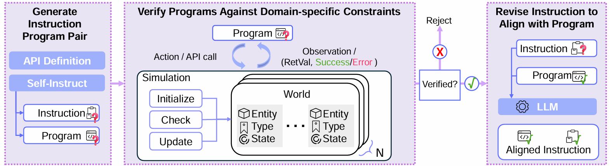

## Robo-Instruct: Simulator-Augmented Instruction Alignment For Finetuning CodeLLMs (Code+Data Coming Soon)

#### [[Project Page]](https://amrl.cs.utexas.edu/robo-instruct/) [[Paper]](https://amrl.cs.utexas.edu/robo-instruct/assets/documents/Democratizing_LLM_arvix.pdf) 


Zichao Hu<sup>1</sup>, Junyi Jessy Li<sup>1</sup>, Arjun Guha<sup>2</sup>, Joydeep Biswas<sup>1</sup>

<sup>1</sup>UT Austin, <sup>2</sup>Northeastern University



## Setup

1. Clone the this repository from GitHub.

```bash
git clone git@github.com:ut-amrl/robo-instruct.git
```
2. Create a new conda environment
```bash
conda env create -n robo-instruct python=3.8
```
3. Install the required depencies in the directory
```bash
pip install -e .
```

## Get Started
To evaluate an LLM on roboeval, run
```bash
python roboeval_vllm.py -m {MODEL_PATH}
```
For example, to run Llama3-8B-Inst with a temperature setting of 0 and generate only one program per prompt:
```bash
python roboeval_vllm.py -m meta-llama/Meta-Llama-3-8B-Instruct --use_llama3_inst --num_completions 1 --temperature 0
```
By default, the results will be saved in the `eval_results/pass1` and `eval_results/error_breakdown` folders. The `eval_results/pass1` folder contains the average pass@1 score for each prompt, while the `eval_results/error_breakdown` folder stores the count of each error type from the generated programs.

## Generate Data Using Robo-Instruct
The code for the data generation pipeline can be found under `robo_instruct/generate_data`. The process consists of three sequential steps:

1. **Generate Instruction-Program Pairs**:
    ```bash
    python generate_instructions.py 
    python generate_programs.py
    ```

2. **Filter Invalid Programs**:
     ```bash
     python generate_robosim.py
     ```

3. **Align Instructions with Programs**:
     ```bash
     python generate_instalign.py
     ```

After completing these steps, post-process the final generated data:
```bash
python final_post_process_data.py
```

## Finetuning
TODO

## Citation
```
@misc{hu2024roboinstructsimulatoraugmentedinstructionalignment,
      title={Robo-Instruct: Simulator-Augmented Instruction Alignment For Finetuning CodeLLMs}, 
      author={Zichao Hu and Junyi Jessy Li and Arjun Guha and Joydeep Biswas},
      year={2024},
      eprint={2405.20179},
      archivePrefix={arXiv},
      primaryClass={cs.CL},
      url={https://arxiv.org/abs/2405.20179}, 
}
```

**Contact Information**

| Name             | Email                                 |
|------------------|---------------------------------------|
| Zichao Hu        | [zichao@utexas.edu](mailto:zichao@utexas.edu)        |
| Junyi Jessy Li   | [jessy@utexas.edu](mailto:jessy@utexas.edu)          |
| Arjun Guha       | [a.guha@northeastern.edu](mailto:a.guha@northeastern.edu) |
| Joydeep Biswas   | [joydeepb@utexas.edu](mailto:joydeepb@utexas.edu)    |

<!-- ### Setup
```bash
pip install -e .
```

### Preliminary Documentations
1. Part of RoboEval codes are adapted under *roboeval/*
2. Look under *robo_instruct/generate_data/* to see how data is generated
3. To evaluate an LLM, run *roboeval_vllm.py* at the root directory -->