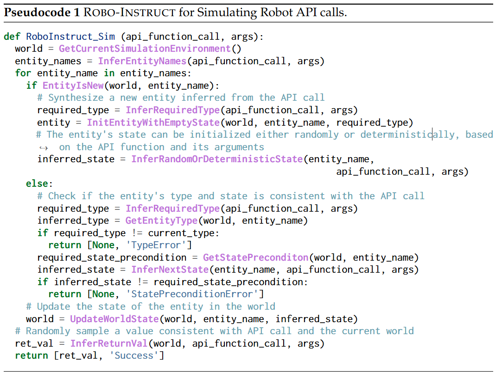
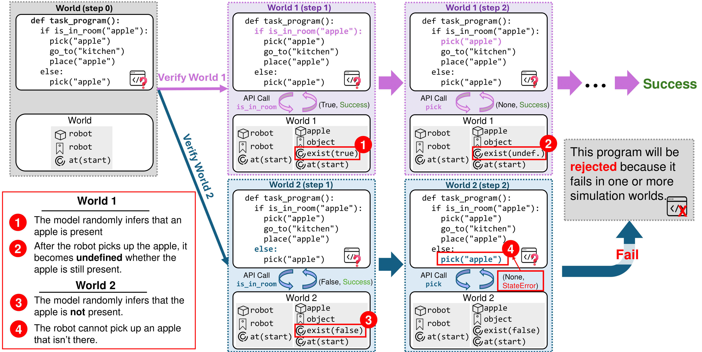
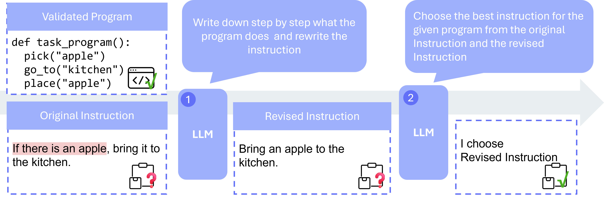
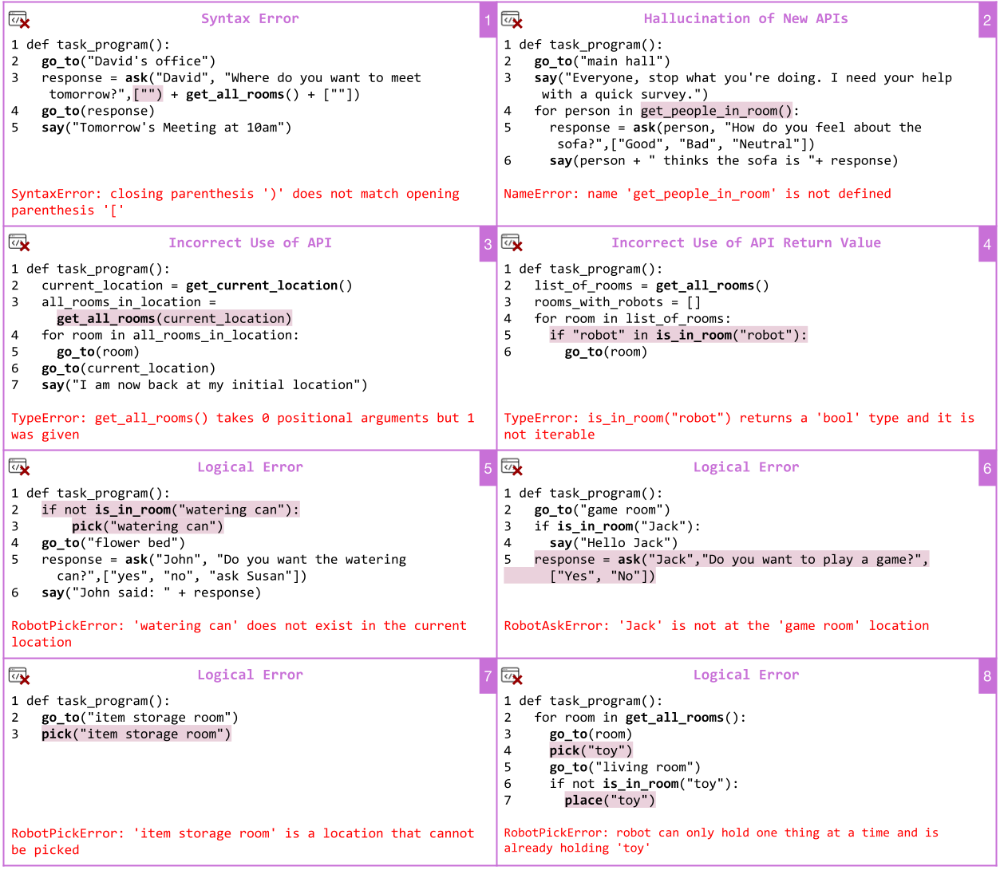

<style>
@import url('https://fonts.googleapis.com/css2?family=Space+Grotesk:wght@500&display=swap');
.curly-font {
    font-family: 'Space Grotesk', cursive;
    color: orange;
}
body {
  font-size: 18px; /* or whatever size you prefer */
}
</style>

<div class="text-center">
  <a type="button" class="btn btn-link" style="margin:20pt; height:40px;" href="https://github.com/ut-amrl/robo-instruct">
    <h5>
       Code
    </h5>
  </a>

  <a role="button" class="btn btn-link" style="margin:20pt; height:40px;" href="https://arxiv.org/abs/2405.20179">
    <h5>
       Paper
    </h5>
  </a>

  <a role="button" class="btn btn-link" style="margin:20pt; height:40px;" href="https://huggingface.co/collections/zichao22/robo-instruct-666089a7338b72a3275f9e69">
    <h5>
       Models/Datasets
    </h5>
  </a>
</div>

<div class="text-center">
  
</div>

<hr>

# Abstract

Code LLMs have shown promising results with converting tasks in natural language to programs that can be executed by service robots. We are interested in finetuning small, specialized LLMs for this purpose, but collecting datasets of task-program pairs specific to each robot is time-consuming and expensive. While approaches such as SELF-INSTRUCT and EVOL-INSTRUCT are capable of generating novel tasks given a few examples, they are unable to provide the corresponding programs that correctly abide by physical-world and robot-constraints using the provided programming interface. Using a simulator is a natural potential solution to checking for such constraints, but building simulation environments that can handle arbitrary tasks and their necessary objects and locations, is challenging. To address these challenges, we introduce ROBO-INSTRUCT, which *synthesizes task-specific simulation environments on the fly* during program execution, by opportunistically inferring entity properties and enforcing corresponding constraints based on how the entities are used in the task program. Additionally, ROBO-INSTRUCT integrates an LLM-aided post-processing procedure to refine instructions for better alignment with robot programs. We demonstrate the effectiveness of ROBO-INSTRUCT across multiple LLMs, showing that our fine-tuned models outperform all baseline methods and even match or surpass the performance of several larger and proprietary models.

<hr>

# Verifying Candidate Programs Against Domain-specific Constraints
To verify candidate programs, we introduce an algorithm inspired by Angelic Execution, which infers program properties from incomplete API specs. As shown in Pseudocode below, it lets developers combine task constraints with robot APIs, automatically synthesizing simulation environments and detecting constraint violations during execution. 
<div class="text-center" style="margin-top:5rem">

  
</div>

<h2 style="text-align: left;">Example</h2>
<div class="text-center">
  
</div>

<script src="assets/js/robosim_demo.js"></script>

<hr>

# LLM-aided Instruction-Program Alignment Procedure
To address this challenge, ROBO-INSTRUCT employs a post-processing procedure to align instructions with their corresponding programs. The key intuition behind this approach is that since the program has already been verified, it can remain fixed, and the *task shifts to finding an instruction that accurately aligns with the program*. Hence, leveraging the advanced code understanding capabilities of modern LLMs, ROBO-INSTRUCT applies Chain-of-Thought reasoning to generate and compare revised instructions, selecting the one that best reflects the program. 
<div class="text-center">
  
</div>

<hr>

# Synthetic Program Execution Failure Analysis

<div style="text-center">
  
</div>

<hr>

# Inference Latency Comparison

<video muted autoplay loop>
  <source src="assets/media/latency.mp4" >
</video>

<hr>

# Model Performances

<div id="bar-chart"></div>
<script src="assets/js/performance_plot.js"></script>


<!-- fine-tuned model -->
<hr>


#### Citation
```shell
@misc{hu2024roboinstruct,
      title={Robo-Instruct: Simulator-Augmented Instruction Alignment For Finetuning CodeLLMs}, 
      author={Zichao Hu and Junyi Jessy Li and Arjun Guha and Joydeep Biswas},
      year={2024},
      eprint={2405.20179},
      archivePrefix={arXiv},
      primaryClass={cs.CL}
}
```