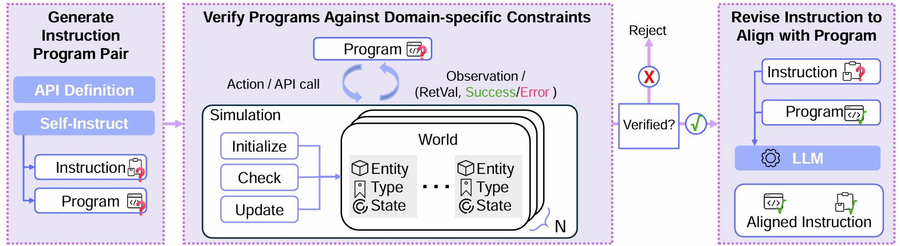
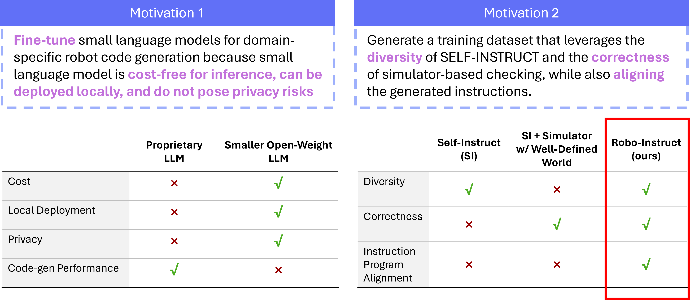
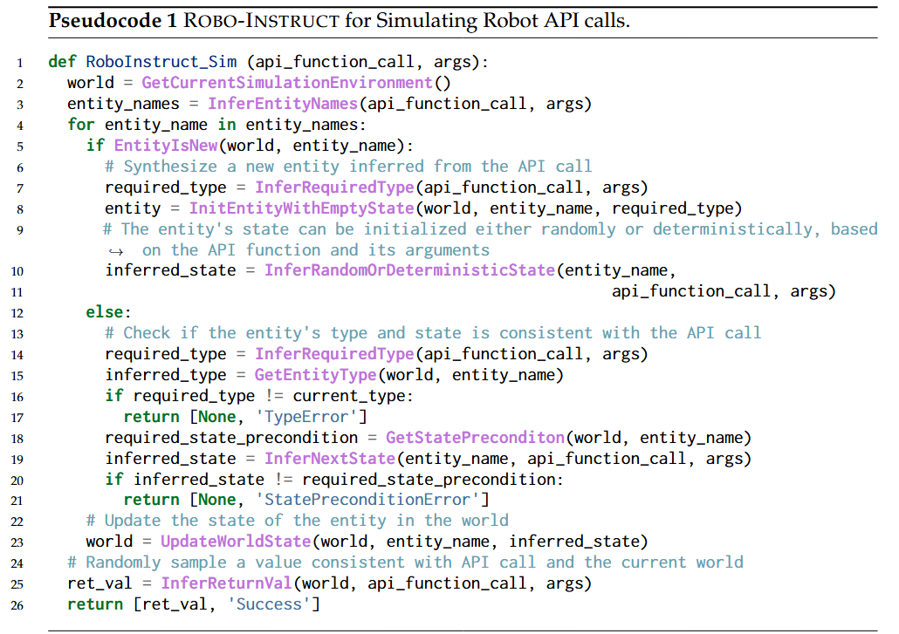
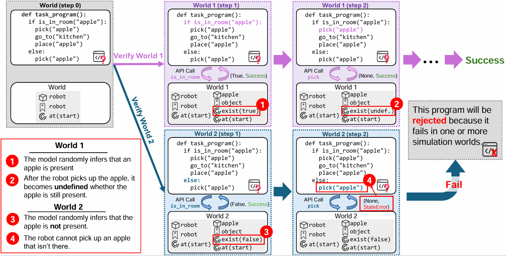
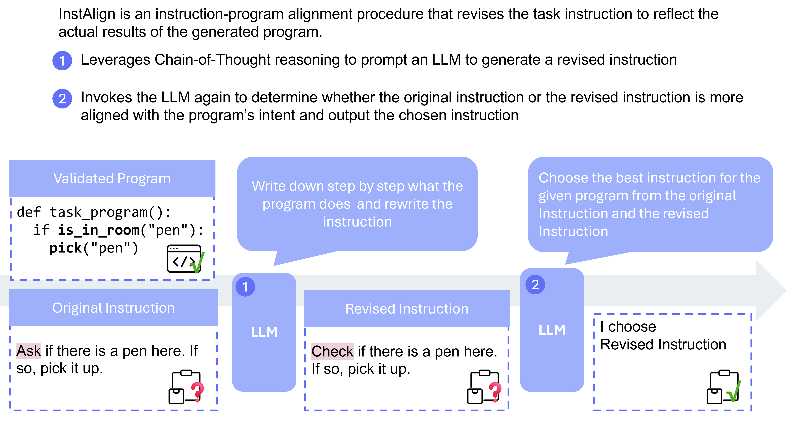
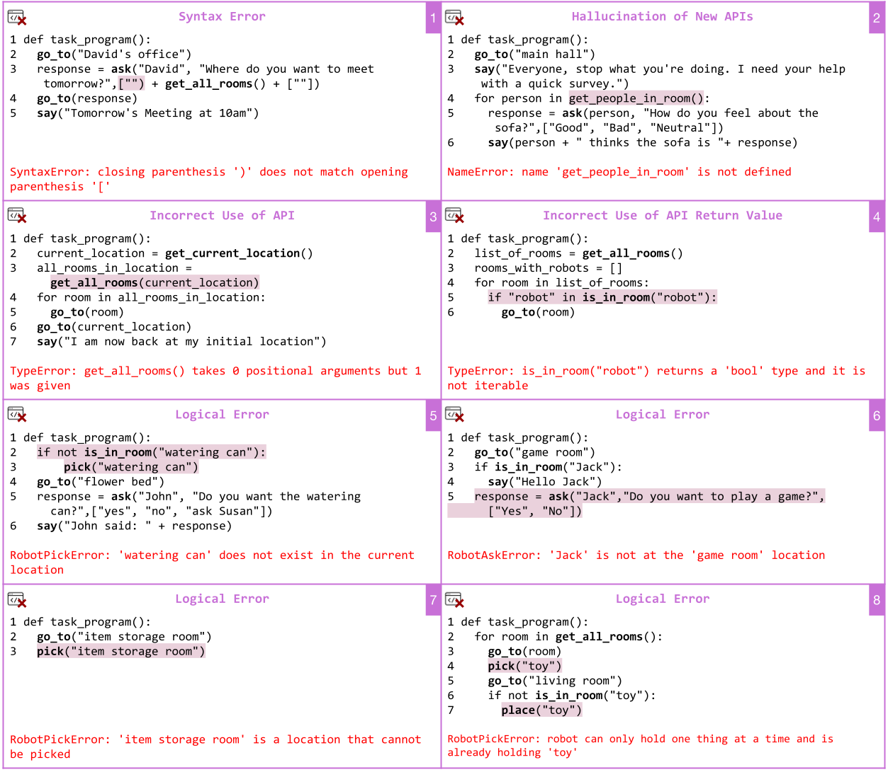

<style>
@import url('https://fonts.googleapis.com/css2?family=Space+Grotesk:wght@500&display=swap');
.curly-font {
    font-family: 'Space Grotesk', cursive;
    color: orange;
}
</style>

<div class="text-center">
  <a type="button" class="btn btn-outline-secondary" style="margin:20pt; height:40px;" href="https://github.com/ut-amrl/robo-instruct">
    <h5>
       Code
    </h5>
  </a>

  <a role="button" class="btn btn-outline-secondary" style="margin:20pt; height:40px;" href="https://arxiv.org/pdf/2405.20179">
    <h5>
       Paper
    </h5>
  </a>
</div>

<div class="text-center">
  
</div>

<hr>

# Abstract

Code LLMs have shown promising results with converting tasks in natural language to programs that can be executed by service robots. We are interested in finetuning small, specialized LLMs for this purpose, but collecting datasets of task-program pairs specific to each robot is time-consuming and expensive. While approaches such as SELF-INSTRUCT and EVOL-INSTRUCT are capable of generating novel tasks given a few examples, they are unable to provide the corresponding programs that correctly abide by physical-world and robot-constraints using the provided programming interface. Using a simulator is a natural potential solution to checking for such constraints, but building simulation environments that can handle arbitrary tasks and their necessary objects and locations, is challenging. To address these challenges, we introduce ROBO-INSTRUCT, which synthesizes task-specific simulation environments on the fly during program execution, by opportunistically inferring entity properties and enforcing corresponding constraints based on how the entities are used in the task program. Additionally, ROBO-INSTRUCT integrates an LLM-aided post-processing procedure to refine instructions for better alignment with robot programs. We demonstrate the effectiveness of ROBO-INSTRUCT across multiple LLMs, showing that our fine-tuned models outperform all baseline methods and even match or surpass the performance of several larger and proprietary models. 
<div class="text-center">
  
</div>

<hr>

# Verifying Programs Against Domain-specific Constraints
ROBO-INSTRUCT generates task and robot program pairs as training data to fine-tune open-weight LLMs for domain-specific service robot tasks. ROBO-INSTRUCT first uses SELF-INSTRUCT to propose novel tasks. For each task, using in-context learning, it prompts a LLM to generate a candidate program to perform the task using the robot APIs in the given context. Then ROBO-INSTRUCT verifies the candidate program by synthesizing a simulation environment *on-the-fly* as API functions are executed (See [Pseudocode 1](#pseudocode-1)). When the simulator catches violations of domain-specific constraints, it rejects the candidate program and re-prompts the LLM for a new candidate program. If the program successfully terminates with no simulation failures, ROBO-INSTRUCT synthesizes additional simulation environments (up to a pre-defined limit) to check for the correctness of the candidate program from different initial configurations and environmental states. ROBO-INSTRUCT is thus able to catch candidate programs that are not robust to environmental variations.


<h2 style="text-align: left;"><a name="pseudocode-1"></a>Algorithm</h2>
The algorithm is built around three core concepts essential for service robots to reason about:
1. Different **entities**, e.g., `"apple"`, `"kitchen"`.
2. The **type** of the entities, and hence their affordances, e.g., `"apple"` is an `object`, you can pick it up; `"kitchen"` is a `location`, you can go to it, and it contains objects.
3. The **state** of the entities in the world, e.g., the `"apple"` is in the `"kitchen"`.

These concepts are closely tied to the robot APIs, where each API invocation during program execution updates the simulation environment.
For example, the `go\_to(loc)` action takes only entities of type `location` as arguments, and executing it changes the *state* of the robot to be at the new location.

<div class="text-center">
  
  
</div>

<h2 style="text-align: left;">Example</h2>
Illustration of ROBO-INSTRUCT executing a task program while incrementally
building the simulation environment. The environment starts with only the robot’s initial
position (gray, step 0). As the program runs, it branches into two possible execution paths.
To evaluate each path, two simulation environments are sampled (world 1 and world 2). In
this example, the program fails because it attempts to pick up an apple that isn’t present.
<div class="text-center">
  
</div>


<hr>

# LLM-aided Instruction-Program Alignment Procedure

<div class="text-center">
  
</div>

<hr>

# Synthetic Program Execution Failure Analysis

<div style="text-center">
  
</div>

<hr>

# Inference Latency Comparison

<video muted autoplay loop>
  <source src="assets/media/latency.mp4" >
</video>

<hr>

<div id="bar-chart"></div>
<script src="assets/js/performance_plot.js"></script>


<!-- fine-tuned model -->
<hr>


#### Citation
```shell
@misc{hu2024roboinstruct,
      title={ROBO-INSTRUCT: Simulator-Augmented Instruction Alignment For Finetuning Code LLMs}, 
      author={Zichao Hu and Junyi Jessy Li and Arjun Guha and Joydeep Biswas},
      year={2024},
      eprint={2405.20179},
      archivePrefix={arXiv},
      primaryClass={cs.CL}
}
```