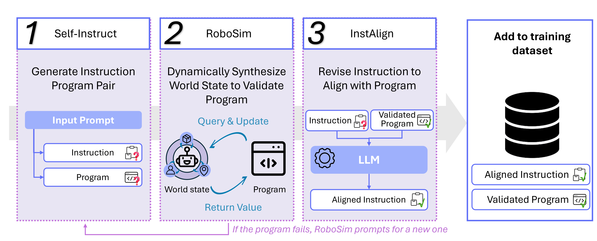
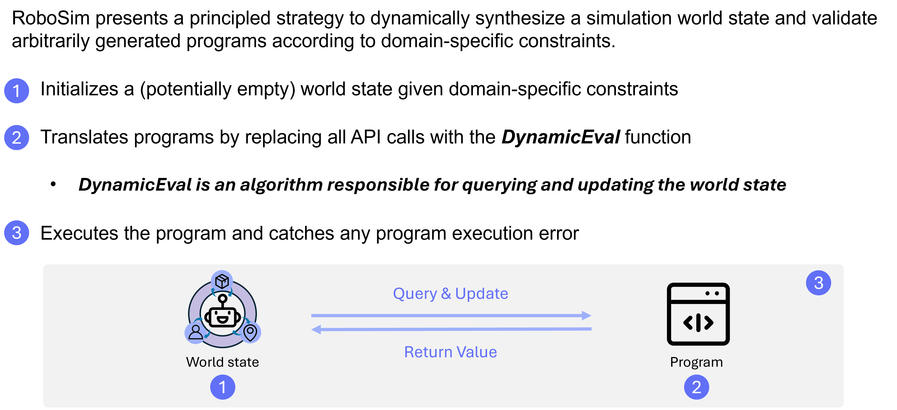
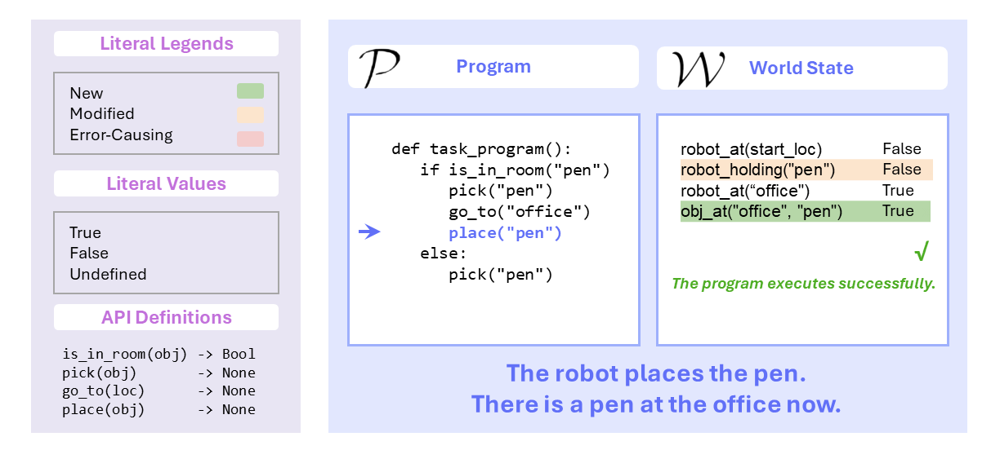
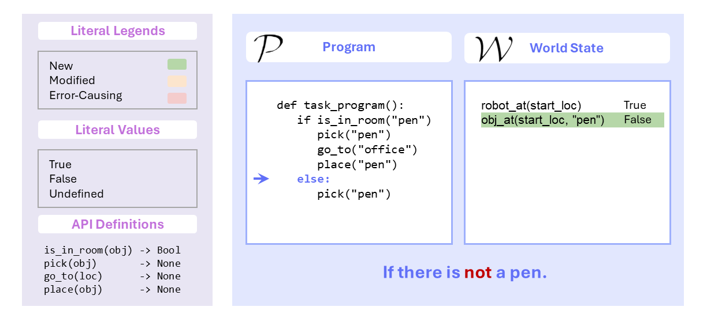

<style>
@import url('https://fonts.googleapis.com/css2?family=Space+Grotesk:wght@500&display=swap');
.curly-font {
    font-family: 'Space Grotesk', cursive;
    color: orange;
}
</style>

<div class="text-center">
  <a type="button" class="btn btn-outline-secondary" style="margin:20pt; height:40px;" href="https://github.com/ut-amrl/robo-instruct">
    <h5>
       Code
    </h5>
  </a>

  <a role="button" class="btn btn-outline-secondary" style="margin:20pt; height:40px;" href="assets/documents/Democratizing_LLM_arvix.pdf">
    <h5>
       Paper
    </h5>
  </a>
</div>

<div class="text-center">
  
</div>

<hr>

# Abstract

Large language models (LLMs) have shown great promise at generating robot programs from natural language given domain-specific robot application programming interfaces (APIs). However, the performance gap between proprietary LLMs and smaller open-weight LLMs remains wide. This raises a question: Can we fine-tune smaller open-weight LLMs for generating domain-specific robot programs to close the performance gap with proprietary LLMs? While Self-Instruct is a promising solution by generating a diverse set of training data, it cannot verify the correctness of these programs. In contrast, a robot simulator with a well-defined world can identify execution errors but limits the diversity of programs that it can verify. In this work, we introduce Robo-Instruct, which brings the best of both worlds -- it promotes the diversity of Self-Instruct while providing the correctness of simulator-based checking. Robo-Instruct introduces RoboSim to synthesize a consistent world state on the fly by inferring properties relevant to the program being checked, and simulating actions accordingly. Furthermore, the instructions and programs generated by Self-Instruct may be subtly inconsistent -- such as the program missing a step implied by the instruction. Robo-Instruct further addresses this with InstAlign, an instruction-program alignment procedure that revises the task instruction to reflect the actual results of the generated program. Given a few seed task descriptions and the robot APIs, Robo-Instruct is capable of generating a training dataset using only a small open-weight model. This dataset can then be used to fine-tune small open-weight language models, enabling them to match or even exceed the performance of several proprietary LLMs, such as GPT-3.5-Turbo and Gemini-Pro.
<div class="text-center">
  
</div>

<hr>

# RoboSim

<div class="text-center">
  
</div>

<div class="text-center" style="margin-top:5rem">
  
</div>

<h2 style="text-align: left;">RoboSim Example</h2>
<div class="text-center">
  <label class="toggle-switch">
      <input type="radio" name="toggle" id="videoBtn" checked onchange="toggleContent('video')">
      <span class="slider"></span>
  </label>
  <strong>Video</strong>
  <label class="toggle-switch">
      <input type="radio" name="toggle" id="demoBtn" onchange="toggleContent('demo')">
      <span class="slider"></span>
  </label>
  <strong>Interactive Demo</strong>
</div>
<div id="videoContent" class="demo-content show">
  <h4><strong>Video</strong></h4>
  <video muted autoplay loop>
    <source src="assets/media/robosim_animation.mp4" type="video/mp4">
  </video>
</div>
<div id="demoContent" class="demo-content">
  <h4><strong>Interactive Demo</strong></h4>
  <div class="text-center mt-2" style="margin: 15px">
    <div id="mediaDisplay" class="media-container">
        
        <video muted autoplay class="media-slide" style="width: 100%; display: none;">
          <source src="assets/media/robosim_example_slide_1.mp4" type="video/mp4">
        </video>
        
        
        
        
        
        
        
        
        
        
        
        
        
        
        <video muted autoplay class="media-slide" style="width: 100%; display: none;">
          <source src="assets/media/robosim_example_slide_16.mp4" type="video/mp4">
        </video>
    </div>
    <div class="mt-3">
        <button id="prevBtn" class="btn btn-primary" onclick="displayPrevious()" style="margin-right:2rem" >Display Previous</button>
        <button id="nextBtn" class="btn btn-primary" onclick="displayNext()" style="margin-left:2rem" >Display Next</button>
    </div>
  </div>
</div>

<script src="assets/js/robosim_demo.js"></script>

<hr>

# InstAlign

<div class="text-center">
  
</div>

<hr>

# Synthetic Program Execution Failure Analysis

<div style="text-center">
  
</div>

<hr>

# Inference Latency Comparison

<video muted autoplay loop>
  <source src="assets/media/latency.mp4" >
</video>

<hr>

# Model Performances

<div id="bar-chart"></div>
<script src="assets/js/performance_plot.js"></script>


<!-- fine-tuned model -->
<hr>


#### Citation
```shell
@misc{hu2024roboinstruct,
      title={Robo-Instruct: Simulator-Augmented Instruction Alignment For Finetuning CodeLLMs}, 
      author={Zichao Hu and Junyi Jessy Li and Arjun Guha and Joydeep Biswas},
      year={2024},
      eprint={2405.20179},
      archivePrefix={arXiv},
      primaryClass={cs.CL}
}
```